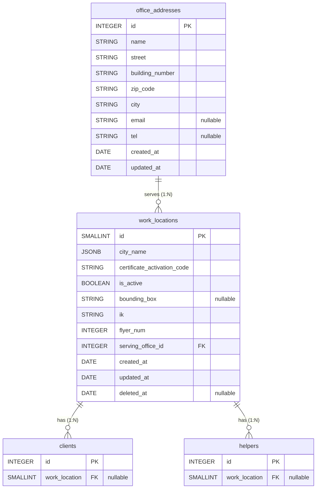

# Entity Relationship Diagram (ERD)
## Work Locations and Office Addresses with Related Models

### Overview
This ERD shows the relationships between work locations, office addresses, and their connections to clients and helpers.

---

## Visual ERD (Mermaid Diagram)



---

## Entity: `office_addresses`
**Description:** Physical office addresses for JUHI offices

| Field             | Type        | Constraints        | Description                         |
| ----------------- | ----------- | ------------------ | ----------------------------------- |
| `id`              | INTEGER     | PK, AUTO_INCREMENT | Primary key                         |
| `name`            | STRING(100) | NOT NULL           | Office name (e.g., "Berlin Office") |
| `street`          | STRING(100) | NOT NULL           | Street name                         |
| `building_number` | STRING(50)  | NOT NULL           | Building number                     |
| `zip_code`        | STRING(10)  | NOT NULL           | ZIP code                            |
| `city`            | STRING(100) | NOT NULL           | City name                           |
| `email`           | STRING(320) | NULLABLE           | Email address                       |
| `tel`             | STRING(50)  | NULLABLE           | Telephone number                    |
| `created_at`      | DATE        | NOT NULL           | Creation timestamp                  |
| `updated_at`      | DATE        | NOT NULL           | Update timestamp                    |

**Relationships:**
- `hasMany` → `work_locations` (via `serving_office_id`)

---

## Entity: `work_locations`
**Description:** Work location cities/regions served by JUHI

| Field                         | Type        | Constraints                          | Description                                                    |
| ----------------------------- | ----------- | ------------------------------------ | -------------------------------------------------------------- |
| `id`                          | SMALLINT    | PK, AUTO_INCREMENT                   | Primary key                                                    |
| `city_name`                   | JSONB       | NOT NULL                             | City name in multiple languages `{de: "Berlin", en: "Berlin"}` |
| `certificate_activation_code` | STRING(50)  | NOT NULL                             | Certificate activation code                                    |
| `is_active`                   | BOOLEAN     | NOT NULL, DEFAULT true               | Whether location is active                                     |
| `bounding_box`                | STRING(100) | NULLABLE                             | Bounding box coordinates "west,south,east,north"               |
| `ik`                          | STRING(50)  | NOT NULL                             | Insurance number (work-location-specific)                      |
| `flyer_num`                   | INTEGER     | NOT NULL                             | Flyer number (work-location-specific)                          |
| `serving_office_id`           | INTEGER     | NOT NULL, FK → `office_addresses.id` | Office that serves this work location                          |
| `created_at`                  | DATE        | NOT NULL                             | Creation timestamp                                             |
| `updated_at`                  | DATE        | NOT NULL                             | Update timestamp                                               |
| `deleted_at`                  | DATE        | NULLABLE                             | Soft delete timestamp                                          |

**Relationships:**
- `belongsTo` → `office_addresses` (via `serving_office_id`)
- `hasMany` → `clients` (via `work_location`)
- `hasMany` → `helpers` (via `work_location`)

**Foreign Key Constraints:**
- `serving_office_id`: `ON UPDATE CASCADE`, `ON DELETE RESTRICT`

---

## Entity: `clients`
**Description:** Client records with work location assignment

| Field           | Type     | Constraints                        | Description                      |
| --------------- | -------- | ---------------------------------- | -------------------------------- |
| `id`            | INTEGER  | PK, AUTO_INCREMENT                 | Primary key                      |
| `work_location` | SMALLINT | NULLABLE, FK → `work_locations.id` | Work location assigned to client |
| ...             | ...      | ...                                | (Other client fields)            |

**Relationships:**
- `belongsTo` → `work_locations` (via `work_location`) - *Note: Association not yet defined in model, but FK exists*

**Foreign Key Constraints:**
- `work_location`: References `work_locations.id` (nullable)

---

## Entity: `helpers`
**Description:** Helper records with work location assignment

| Field           | Type     | Constraints                        | Description                      |
| --------------- | -------- | ---------------------------------- | -------------------------------- |
| `id`            | INTEGER  | PK, AUTO_INCREMENT                 | Primary key                      |
| `work_location` | SMALLINT | NULLABLE, FK → `work_locations.id` | Work location assigned to helper |
| ...             | ...      | ...                                | (Other helper fields)            |

**Relationships:**
- `belongsTo` → `work_locations` (via `work_location`) - *Note: Association not yet defined in model, but FK exists*

**Foreign Key Constraints:**
- `work_location`: References `work_locations.id` (nullable)

---

## Relationship Summary

```
office_addresses (1) ──────< (many) work_locations
                                      │
                                      │ serving_office_id
                                      │
                                      ├───< (many) clients
                                      │    work_location (FK)
                                      │
                                      └───< (many) helpers
                                           work_location (FK)
```

### Cardinality

1. **office_addresses → work_locations**
   - One office address can serve many work locations
   - Each work location belongs to exactly one office address
   - Relationship: **1:N** (One-to-Many)

2. **work_locations → clients**
   - One work location can have many clients
   - Each client can belong to one work location (nullable)
   - Relationship: **1:N** (One-to-Many, optional)

3. **work_locations → helpers**
   - One work location can have many helpers
   - Each helper can belong to one work location (nullable)
   - Relationship: **1:N** (One-to-Many, optional)

---

## Notes

1. **Missing Associations**: The `client` and `helper` models currently have `work_location` foreign key columns but the Sequelize associations (`belongsTo`) are not yet defined in the model files. These should be added for proper ORM functionality.

2. **Soft Deletes**: 
   - `work_locations` uses soft deletes (`deleted_at`)
   - `office_addresses` does NOT use soft deletes

3. **Data Flow**:
   - Office addresses are the top-level entity
   - Work locations reference office addresses
   - Clients and helpers reference work locations

---

*Generated: January 27, 2026*
